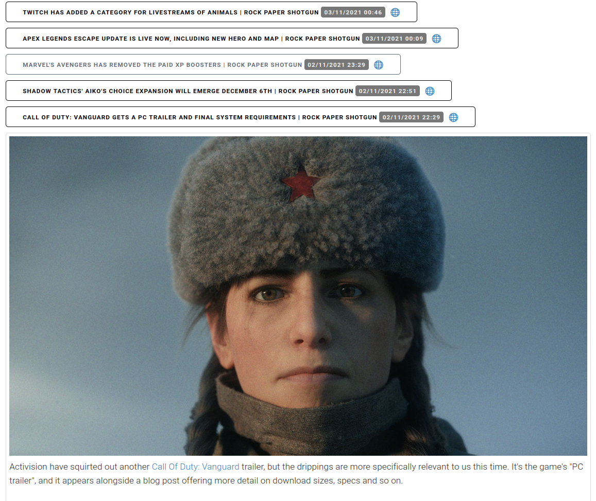

# PBRR - Pretty Basic RSS Reader

## Intro

Building a simple RSS reader that fetches feeds from an OPML file and generates a simple html hierarchy with the posts grouped per site and category (if the OPML file had categories).

No intention of building any complex website, just cron-based runs dumping new entries, not even deleting old ones (list will anyway only reflect latest N items). Keep minimum state.

Here's how it looks:



If a feed/site has no news (returns an http 304), it will keep the existing list of posts.

Version 1.0 was more Python heavy. Version 2.0 basically uses Python only for the backend (RSS fetch), storing in JSON files that then get read and rendered by a tiny Preact-based frontend (client-side, no need for SSR).

## Setup

Just need Docker, but to setup without containers:
```
pip3 install -r /code/requirements.txt
```

## Running

From the outside:
```
make run
```

Without Docker:
```
python3 run.py feeds subscriptions.xml
```

`subscriptions.xml` file is your OPML (Outline Processor Markup Language) is an XML format that bundles RSS feeds into a single text file and you can generate one online using your feeds. PBRR parser expects `outline`, `xmlUrl`, `type=rss` tags to be present in this file. Create a `feeds` directory and place `subscriptions.xml` file in it before running `python3 run.py feeds subscription.xml`,

An `index.html` file will be placed at `feeds/index.html` once finished fetching. That's your "reader" entry point. When you open `index.html` file directly, browser blocks the content because of CORS. You can render the page by running a local server instead. You can run one by running `python3 -m http.server 8000` or `npx serve`. 

```

Also, a `settings-v2.json` file will be generated. Inside it, you can add urls to the skip urls setting (e.g. if a feed is not working with PBRR). It's a list of strings, you can manually add new entries, for example `"https://site-to-skip.test"`.

Another "internal hack" you can do inside the settings file is add new entries under the `category_emoji_icons` block, for example: "`"category_emoji_icons": {"News - Games": "🎮"}`" and it will render the emoji after the site if its category matches.

## Development

```
make shell
python3 run.py feeds subscriptions.xml
```

Uses:
- [Beautiful Soup](https://www.crummy.com/software/BeautifulSoup/), because makes parsing HTML and XML way more pleasant
- [Milligram](https://milligram.io/), because my CSS skills equal to `null` and I wanted something minimalistic
- [Preact](https://preactjs.com/), because I wanted all Javascript to be client-side, but at the same time wanted to begin practising with React
- [feedparser](https://feedparser.readthedocs.io) for easier handling of feeds, and yet, they keep causing headaches

To be able to perform AJAX calls in local, with Firefox you need to allow CORS with local `file://` urls: type `about:config` and set `privacy.file_unique_origin` to `false` (remember to change it back to `true` when finished!).

## Testing

For the time being, no intention of adding tests to the project.

## TODOs

- run mypy on pre-commit if possible

## License

See [LICENSE](LICENSE).
